<a name="top"></a>
#  Wild Cards Memory Game

Wild cards is a two player memory game designed for people of all ages but especially kids.

This website is showcasing Javascript, HTML and CSS design for Project Portfolio 2 and can be accessed by following this [link.](https://johnamdickson.github.io/Portfolio-Project-2/)


## Contents
- [UX](#ux)
  - [Strategy](#strategy)
    - [User Stories](#user-stories)
  - [Scope](#scope)
    - [Essential Content](#essential-content)
    - [Optional Content](#optional-content)
  - [Structure](#structure)
  - [Skeleton](#structure)
    - [Wireframes](#wireframes)
  - [Surface(Design)](#surface-design)
    - [Colour Scheme](#colour-scheme)
    - [Imagery](#imagery)
    - [Logo](#logo)
    - [Typography](#typography)
- [Features](#features)
  - [Existing Features](#existing-features)
  - [Features Left to Implement](#features-left-to-implement)
- [Testing](#testing)
  - [Development Testing](#development-testing)
  - [Testing User Stories](#testing-user-stories)
     - [Adult User Goals](#adult-user-goals)
     - [Child User Goals](#child-user-goals)
     - [Site Administrator Goals](#site-administrator-goals)
  - [Responsiveness Testing](#responsiveness-testing)
    - [Physical Device](#physical-device)
    - [Simulated Devices](#simulated-devices)
  - [Browser Compatability](#browser-compatability)
  - [Validator Testing](#validator-testing)
  - [Bugs / Issues](#bugs--issues)
  - [Unresolved Bugs / Issues](#unresolved-bugs-or-issues)
- [Deployment](#deployment)
  - [Git Hub Pages](#github-pages)
  - [Forking the GitHub Repository](#forking-the-github-repository)
  - [Making a Local Clone](#making-a-local-clone)
- [Credits](#credits)
  - [Content](#content)
  - [Media](#media)


## UX
### Strategy
The objective of the site is to create a two player memory card game directed towards young children and their parents which will demonstrate the Portfolio Project 2 requirements.
#### User Stories
- Adult User Goals:
  - I want to promote my child's development of their visual perceptual skills, including their ability to match two objects that are the same (visual discrimination) and their ability to remember visual information (visual memory).
  - I want the game to encourage turn taking by giving feedback on which player's turn it is.
  - I want to be able to play the game on all devices including PC/Mac, tablets and mobile phones.
  - I want responsive feedback from buttons and cards on the website.
  - I want to promote my children to develop their hand eye coordination.
<br><br>
- Child User Goals:
  - I want to engage in a fun game with my parents or caregiver.
  - I want to be visually stimulated by the site including background picture, card pictures and colours.
<br><br>
- Site Administrator Goals:
  - I want to easily identify issues or bugs by having clear and concise code with annotations.
  - I want to promote a fun online environment and game for parents and children to enjoy together.
  - I want the game to be accessible to all users including those that are visually impaired.

### Scope
#### Essential Content
 - The site will have 16 cards that can be clicked to turn over.
 - The site will keep track of player turns and will give visual feedback of this.
 - The site should give feedback on successful matches.
 - The site should keep track of the scores. 
 - There should be a game outcome feedback once all cards are turned over.
 - There should be alt text describing each animal image for visually impaired users. <br><br>
#### Optional Content
- The site will have background music.
- The site will have audible effects or descriptions for each animal when the cards are turned over and matched. 
- 1 player game option against the computer.<br><br>
### Structure
 - The site will have a logo at the top of the page.
 - There will be a game section containing all of the game elements.
 - The first element will be a game information div.
 - The next will be a game grid consisting of 16 cards arranged in a 4 x 4 grid.
 - Each card will have a front and reverse with a blank side and then an hidden animal at the back.
 - There will be a game information area which will keep track of player turns and their respective scores.<br><br>
### Skeleton
#### Wireframes
- Three wireframes were developed for the project, all of which are listed and linked below:
  - [Web browser wireframe](/assets/README-files/web-browser-wireframe.png)
  - [Tablet wireframe](/assets/README-files/tablet-wireframe.png) 
  - [Mobile wireframe](/assets/README-files/mobile-wireframe.png)<br><br>
### Surface (Design)
#### Colour Scheme

- The site colour scheme revolves around three strong colours as shown in the palette. 
- The colours were chosen to create a striking contrast, especially between the *Confetti* and *Biscay* colours.
- Another consideration was to have colours that stood out agains the background image. <br><br>
#### Imagery

- The background image was selcted to again cater for the visual needs of children and as a way of introducing them and other users to the game.<br><br>
#### Logo

- The choice of site logo was based upon one that would be fun and engaging for children and have an immediate connection with the content. The logo utilises two of the colours from the site colour scheme: *Biscay* and *Powder Blue*.
- The name is a play on words to make the site memorable in the hope of drawing users back to play.<br><br>
#### Typography
- All fonts were sourced from Google Fonts. The main font used throughout is called *Love Ya Like A Sister* which was selected for it's fun characteristics that children can relate too even if they cannot read. *Raleway* was selected for the buttons' font to make it stand out to adults who will normally be controlling the game.<br><br>

<a href="#top">BACK TO TOP 🔼</a>

## Features 

### Existing Features

- __The Game Information Area__ <br><br>
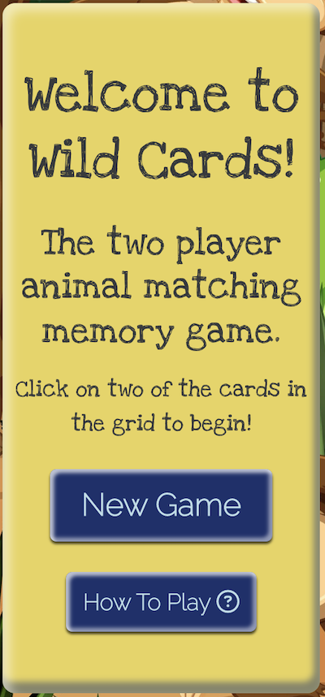

  - The game information div contains an `<h2>` welcome message and short `<p>` giving an overview of the game. There are two buttons at the bottom of the div -  *New Game* and *How To Play*. The former button gives the option to restart the game whilst the latter directs the user to an instructions div described below. The buttons are styled to have an embossed look using inset box shadows along with an outset shadow. The buttons have mousedown and mouseup event listeners where the mousedown removes the outset shadow and the mouseup returns the styling to normal. This creates the impression of the button being pressed and springing back to position once released.<br><br>
- __The Game Instructions__ <br><br>
 

  - When the *How To Play* button is pressed two divs  - blurred and instructions - are made visible from their default *visibility: hidden / display: none property*. The blurred div covers the entire screen and creates a visual effect that accentuates the instructions div and contents and helps create a contrast against the backdrop of the game. The instructions div contains an `<ol>` of instructions followed by *New Game* and *Go Back* buttons. The former button completes the same action as its namesake described in Game Information above, whilst the latter returns the user to the current game. Both buttons return the two divs to their default visibility status of hidden.<br><br>
- __The Game Area__ <br><br>


    - The game area consists of a div of the site blue colour with embossed edges and rounded corners. A 4 x 4 grid element is contained within this div and holds all 16 of the game cards. 
    - Each game card has two sides, the reverse side with a paw print emblem and the front side containing the animal pictures.
    - When the user hovers over a card the cursor changes to a pointer. The card is responsively styled to marginally grow along with the border getting slightly thicker using the the hover pseudo element.
    - When an unsuccessful match is made, the cards turn back around and the turn changes to the alternate player.
    - When a successful match is made, a congratualtory message (described below) is displayed and the incumbent player gets another turn.
    - The cards remain turned over revealing the animal pictures after a successful match.
    - The game continues until all animal pairs are matched at which point a game outcome message appears, again described below. <br><br>
- __The Player Information Area__ <br><br>


  - The player info div contains two divs showing which player's turn it is and a scores area. The player info updates dynamically once the players turn changes. The scores area contains the player scores and updates on a successful match of animals. In order to draw the users attention here after the site loads or a new game is selected, the elements animate in after a short time delay.<br><br>
- __The Congratulatory Message__ <br><br>


    - As described above, when the user successfully matches two animals they are presented with a congratulatory message. This takes the form of a star to make it visually engaging for children. The animal name is passed into the `<span>` at the end of the congratulatory message.
    - There is also a background div covering the entire view which introduces a blurred effect to slightly obscure the background and create a greater contrast with the star.<br><br>

- __The Game Outcome__ <br><br>

   - Once the final pair of animals are successfully matched and the game is completed, an outcome star appears on top of a blurred background div displaying one of three messages depending on the calcualted outcome of the game:
     - *That was close, its a draw!*
     - *Congrats Player 1, you win!*
     - *Congrats Player 2, you win!*
   - After a short time delay, the message on the start changes to *Click below to begin a new game* and a *New Game* button appears.

- __The Footer__ <br><br>

    - The footer contains links to background and animal images on Freepik per licensing requirement.

### Features Left to Implement
- The optional features identified in the scope phase were not implemented in this iteration of the site due to their complexity and time demands. 
- As a reminder, the features are listed below
  - Voice and/or animal sounds on a successful match.
  - Background music.
  - 1 player game against the computer.
- In future versions of this game I would like to revisit these features and assess the feasiblity of implementing them.<br><br>

<a href="#top">BACK TO TOP 🔼</a>
## Technologies Used
### Languages Used
- HTML5
- CSS3
- Javascript ES6.

### Frameworks, Libraries & Programs Used
- Hover.css used on buttons and cards.
- Google Fonts used for all typography.
- Font Awesome used for icons in *How To Play* / *Go Back* buttons and also the stars for the congrulatory / game outcome messages.
- Git used for version control.
- GitHub as cloud repository for Git version control.
- Gitpod cloud based IDE used at the beginning of the project.
- Codeanywhere cloud based IDE used during the project.
- VSCode desktop based IDE used at the end of the project. <br><br>

<a href="#top">BACK TO TOP 🔼</a>
## Testing 
### Development Testing

- __The Game Information Area__
  - The *New Game* button was tested and worked correctly by reloading the window.
  - The *How To Play* button was tested and opened up the game instructions as expected, with the associated blurred background div also presenting.  <br><br>
- __The Instructions Area__
  - The *New Game* button was tested and worked correctly by hiding the blurred div and instructions area before reloading the window.
  - The *Go Back* was tested and worked as expected by hiding the blurred div and instructions and returning to the game in progress.<br><br>
- __The Game Area__
  - Two cards were selected by clicking on them. They both turned over in the y-axis as expected.
  - When the cursor moved over a card the pointer selector appeared. The cards also responded as per CSS styling to marginally increase in size.
  - In the case of an unsuccessul match, the cards remained in position for a short period before turning back around and hiding the animal images.
  - Attempts to turn over more than two cards were unsuccessful which is the correct behaviour.
  - When a match was made, the cards remained in the position with the animal images facing towards the user and remained that way until the end of the game.<br><br>
- __The Player Information Area__
  - The player number alternated between 1 and 2 correctly throughout the game.
  - The players scores incremented correctly on successful match of animal images.<br><br>
- __The Congratulatory Message__
  - The congrulatory message, star and blurred background div appeared as expected after a successful match of animal images. 
  - The message contained the correct animal name in it.
  - The star and message both animated in and out as expected.<br><br>
- __The Game Outcome__
  - The game outcome star and message appeared as expected at the culmination of the game. 
  - The message accurately represented the outcome of the game.
  - The message changed to the prompt for starting a new game and the *New Game* button appeared.
  - The *New Game* functioned as expected, commencing a new game after hiding the outcome message and blurred background div.<br><br>

### Testing User Stories
In order to test children's responses to the site, I asked my two daughters Issey(9) and Sienna(6) to partake in the test by playing each other at the game. I also requested my wife to join in for a game with each child to subjectively assess the adult user goals.
#### Adult User Goals
- **I want to promote my child's development of their visual perceptual skills, including their ability to match two objects that are the same (visual discrimination) and their ability to remember visual information (visual memory).**
  - The site delivers on this goal as it presents an animal matching game (visual discrimination) along with the requirement to memorise where the correct animal pairs are (visual memory).
- **I want the game to encourage turn taking by giving feedback on which player's turn it is.**
  - The player information area dynamically updates which player's turn it is and feeds this back to the user.
- **I want to be able to play the game on all devices including PC/Mac, tablets and mobile phones.**
  - The site was tested across multiple devices both physically and on the simulator and operated satisfactorily.
- **I want responsive feedback from buttons and cards on the website**.
  - The buttons and cards both offer responsive feedback using hover psuedo classes and associated styling. 
  - The buttons have further styling so that when clicked they appear to depress into the screen.
- **I want to promote my children to develop their hand eye coordination**.
   - Whilst playing with my children, who are at different developmental stages, I was able to establish that the requirement to line up the cursor with the correct card and then clicking does promote development of hand eye coordination. This developent would be even more profound for younger children who may only be starting to use computers or devices.

#### Child User Goals
  - **I want to engage in a fun game with my parents or caregiver.**
    - As detailed above, my two children partook in a serious of games with each other, with my wife and with me. I asked them if they felt the game was fun and engaging. Their responses - detailed below - help demonstrate that this goal was met:
       - Issey - *"It was very competitive. I enjoyed playing it together and it was really fun. I think it was better playing with another person. It would be cool to be able to play with the computer."*
       - Sienna - *"I liked that it was fun but even if you lose you're still having fun. I liked playing with my daddy."*
  - **I want to be visually stimulated by the site including background picture, card pictures and colours.**
    - I asked the girls what they thought of the site colours and pictures. Their responses below also help to demonstrate that this goal was met:
      - Issey - *"I like the paw prints on the backs of the cards. It would be nice to have a link to the person that created the site as well. The colours would be vibrant for young children. The background is fun, but I like that the cards just have one animal."*
      - Sienna - *"I like the yellow as it's bright and the blue is bright as well. I like the background because they all have something that they are doing. I really like the cards because they are cool and bright and colourful"*

#### Site Administrator Goals
  - **I want to easily identify issues or bugs by having clear and concise code with annotations.**
    - The code in this project is appropriately annotated to allow for easy identification of issues/bugs.
  - **I want to promote a fun online environment and game for parents and children to enjoy together.**
    - Based on feedback from my family, this game offers a fun online environment for both children and their parents.
  - **I want the game to be accessible to all users including those that are visually impaired.**
    - Each card has an alt text attribute which was shown to display in the features section. Lighthouse returned an accessibility score of 100 and the colour contrast were also checked.

### Responsiveness Testing
#### Physical Device
- I first tested the game on my own phone - an iPhone 12 Pro Max. The responsive styling worked as expected for this screen size, implementing a flex column to the game section. 
- My initial fear with doing this kind of game was that the animal image would not be clear on a small screen size. As can be seen from the screenshot, that is not the case. 
- The congratulatory and outcome messages were also tested for responsiveness and appeared as designed.
 <table  width = 100% cellspacing="0" cellpadding="0">
 <caption>Physical Device Responsiveness Test</caption>
  <tr>
  <td>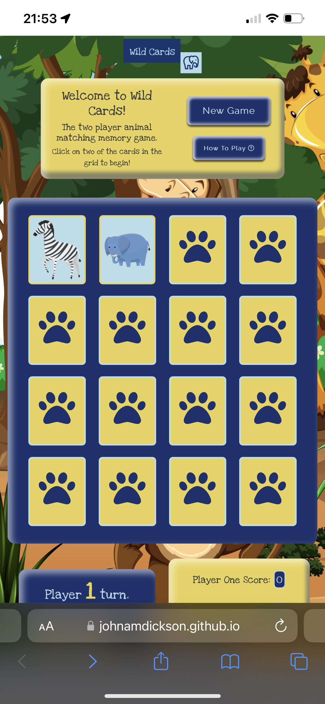</td>
  <td> 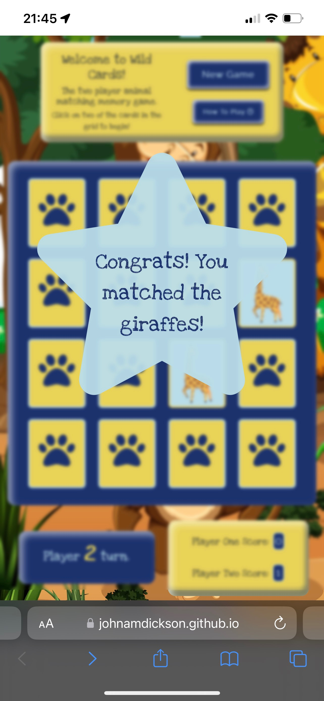</td>
    <td> 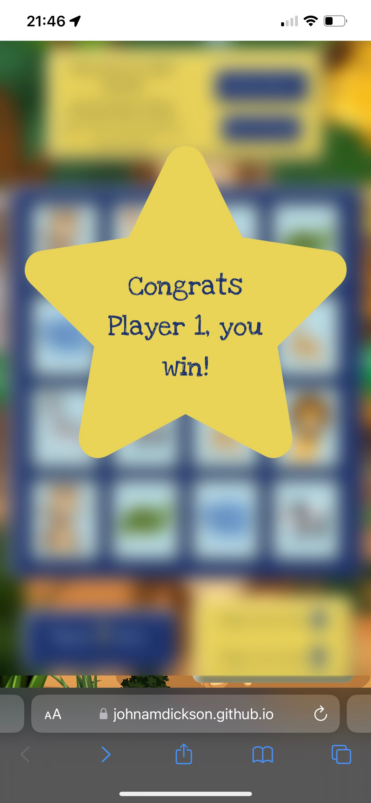</td>
  </tr>
  </table>

#### Simulated Devices
- The following devices were selected for responsiveness testing on Chrome Devtools:
  - iPhone 6/7/8. Responsiveness is good for those devices:<br><br>
  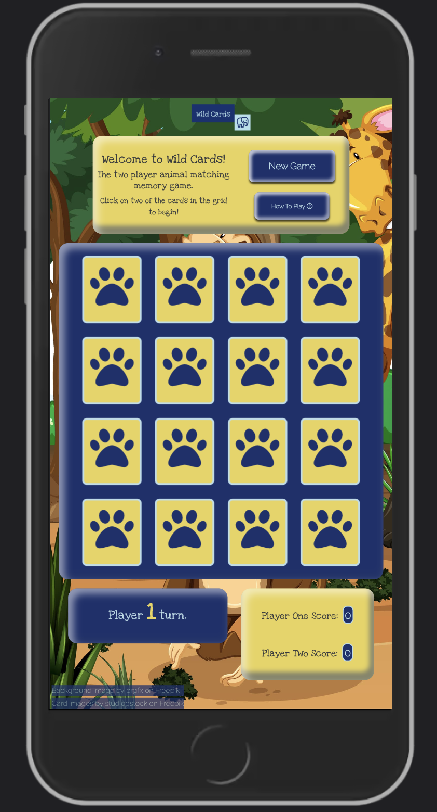<br><br>
  - Samsung Galaxy S9+. Responsiveness is good for this device:<br><br>
  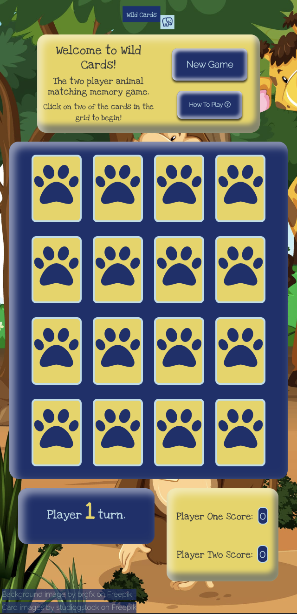<br><br>
  - iPad. Responsiveness is good for this device:<br><br>
  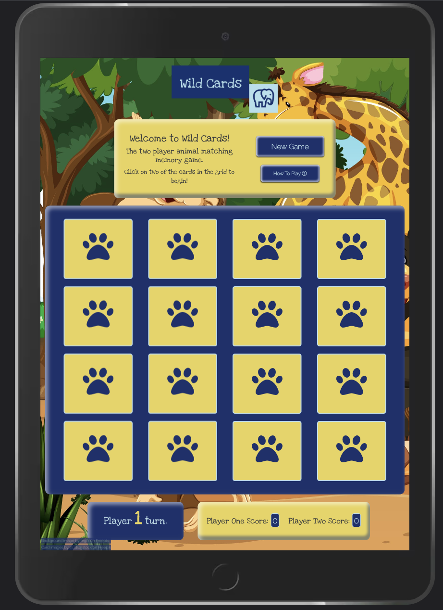<br><br>
  - iPad Pro. Responsiveness is good for this device:<br><br>
  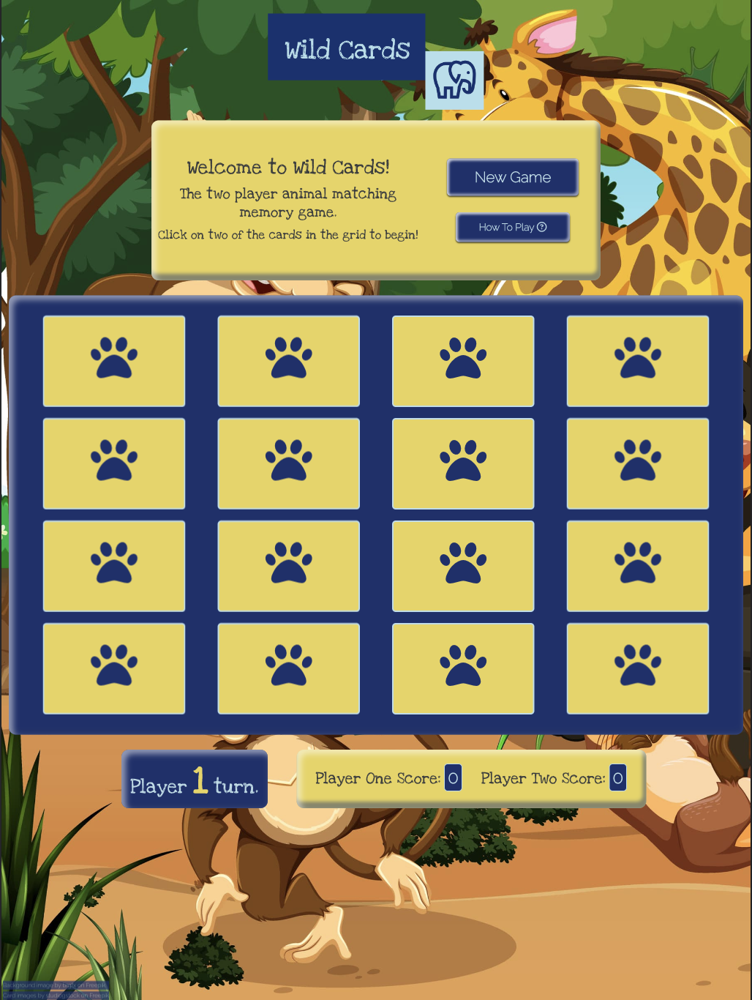<br><br>
  - Desktop with a width <= 1200px. Responsiveness is okay for this device and view width. Given the fixed height of the game area there is a requirement to scroll down to access the game. Crucially the three game section elements are all visible in the veiwport together after scrolling:<br><br>
    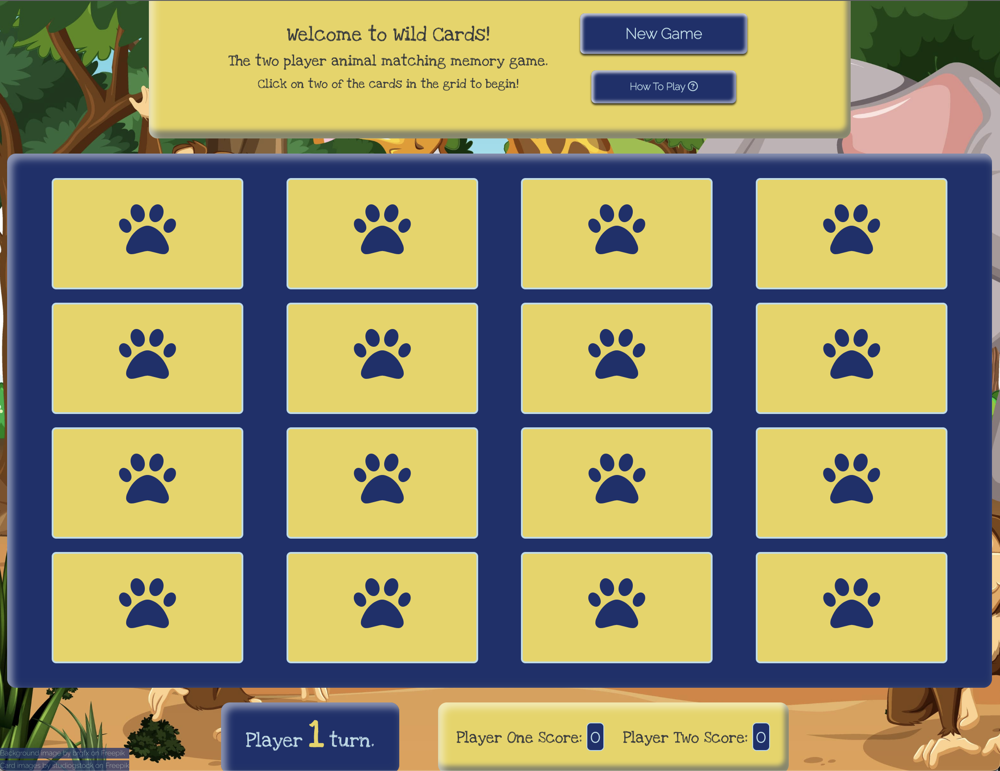<br><br>
  - Desktop with a width > 1200px. Responsiveness is good for this device and view width:<br><br>
      1200px.png" height=300px><br><br>
### Browser Compatability
 - The game was tested on Chrome, Firefox, Safari and Microsoft Edge. The appearance and responsiveness on each platform was good and the only minor difference observed was on the Safari browser where the *How To Play* button Font Awesome icon spilling over on to another line. This did not detract from the buttons appearance so was left as is.<br><br>
 
### Validator Testing 

- HTML
  - No errors were returned for the page when passing through the official W3C HTML validator:
    <br><br>
    
- CSS
  - No errors were returned for the page when passing through the official W3C CSS validator:
    <br><br>

- Javascript
  - No errors or warnings were returned when passing the JS code through JSHint.
  <br><br>

- Accessibility
  - Accessibility of the page was checked using the lighthouse tool in devtools. The results were satisfactory for both desktop and mobile as shown below.
     - Desktop results:
     
     - Mobile results:
     
<br><br>
  - The colour contrasts of Confetti background with a Biscay foreground Biscay background with Powder Blue foreground were checked and passed the applicable tests on Web AIM contrast checker.<br><br>
  
  <table  width = 100% cellspacing="0" cellpadding="0">
  <tr>
  <td>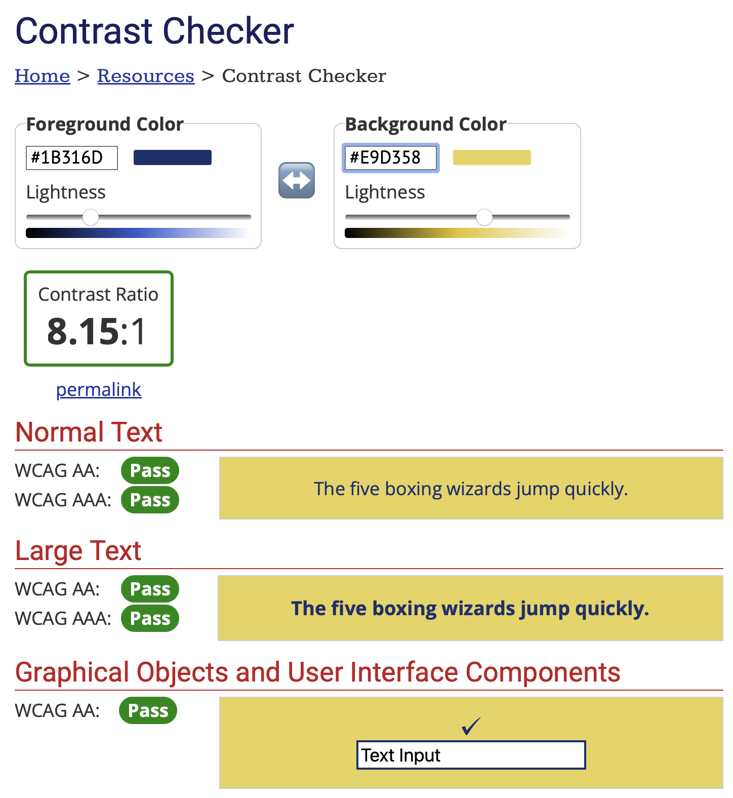</td>
  <td> 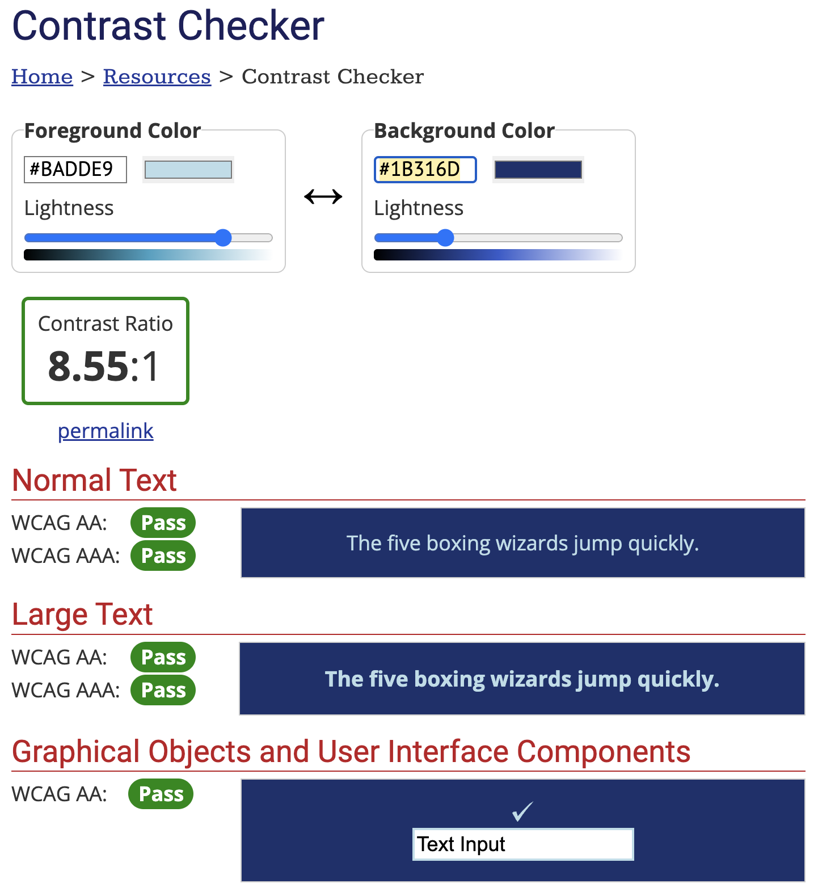</td>
  </tr>
  </table>

  - Images alt text properties were checked using Chrome extension [Alt Text Checker.](https://chrome.google.com/webstore/detail/alt-text-tester/koldhcllpbdfcdpfpbldbicbgddglodk)
  <br><br>
 
<a href="#top">BACK TO TOP 🔼</a>
### Bugs / Issues
<table  width = 100% cellspacing="0" cellpadding="0">
  <tr>
  <th>Issue/Bug</th>
  <th>Solution</th>
  </tr>
  <tr>
   <td>Issue with images on cards. All except first card retained 2 animal images</td>
   <td>Used query selector on each card front div to check existence of the animal-images class prior to removing old images</td>
  </tr>
  <tr>
   <td>On new game start animal images were visible when cards were rotating</td>
   <td>Utilised setTimeOut function to add animal images after 750 ms</td>
   </tr>
   <tr>
   <td>Issue with 950px and the game status div paragraph line breaks, subsequently changed to 1200px.</td>
   <td>Resolved using Media Query List in JS</td>
   </tr>
   <tr>
   <td>Issue on safari with card background colour superseding the animal image</td>
   <td>Changed background to transparent which resolved the issue.</td>
   </tr>
   <tr>
   <td>During mentoring call, mentor observed long load time for background image</td>
   <td>Used online compressor to decrease memory allocation and improve performance</td>
   </tr>
   <tr>
   <td>JSHint error: Functions declared within loops referencing an outer scoped variable may lead to confusing semantics</td>
   <td>Moved for let card of carsTurned inside the setTimeOut function to resolve the error.</td>
   </tr>
   <tr>
   <td>Observed issue where flipped cards could be selected again for a new turn and they subsequently flip over again in error resulting in one card being face up</td>
   <td>Handled by checking to ensure cards have a “card” class before assigning event listeners</td>
   </tr>
   <tr>
   <td>Issue on Safari browser with feedback and outcome stars during animation. Cards randomly appear on top of the star during animation and thereafter</td>
   <td>Investigated issue and found that the element transform affects the stacking context. Resolved issue by adding a background divs that the feedback and outcome stars are children of</td>
   </tr>
   <tr>
   <td>Outcome and feedback star alignment issue bot stars on physical device and Edge browser misaligned, not repeating in devtools</td>
   <td>Changed to flex display on background divs</td>
   </tr>
   <tr>
   <td>Issue with multiple animals appearing on cards when New Game button pressed repeatedly. This happens due to other timeout functions further down the code giving an opportunity for animal images to be added again prior to the game starting</td>
   <td>Added code to temporarily disable the buttons for 1 second to allow for game to begin</td>
   </tr>
   <tr>
   <td>When testing iPad Pro responsiveness, I observed numerous issues with overflow as per the following image:<br>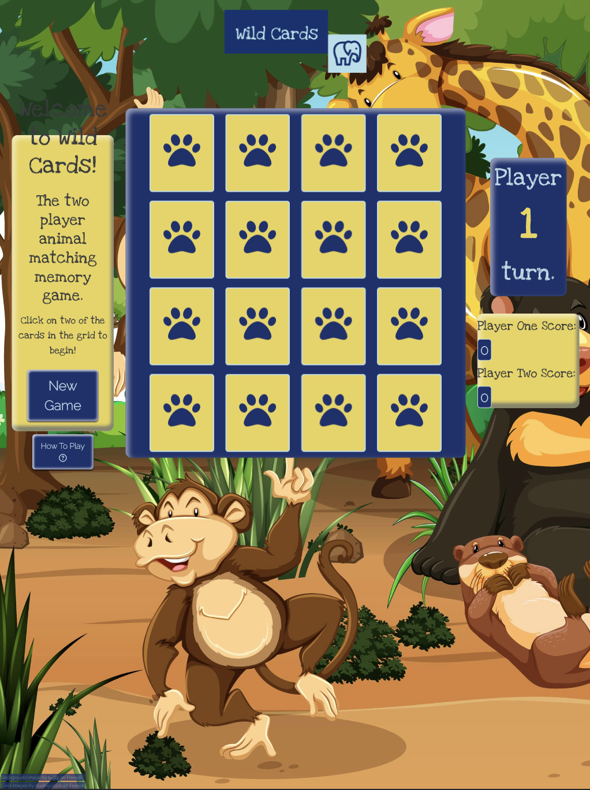</td>
   <td>Amended JS media query list to 1200px which resolved the issue as shown in the responsiveness testing section</td>
   </tr>
   <tr>
   <td>Issue with footer appearance whereby the two anchor elements appear above the bottom of the screen on some devices. During development I switched from different position properties which worked satisfactorily on some devices but not others: 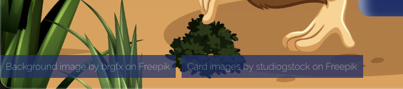</td>
   <td>Changed footer to fixed and flex display to stack the anchor elements on top of on another as shown in the features section</td>
   </tr>
   <tr>
   <td>Issue with check for match call passing player one instead of player two in the appropriate case</td>
   <td>Found bug with wrong player number being passed into the feedbackMatch function</td>
   </tr>
  </table>

### Unresolved Bugs or Issues
- The most time consuming error I encountered was an issue with scoring. For the first round the scores worked as expected. If a new game was started midway through an in progress game then the scores would increment by 2. If this happened again the score would increment by 3 and so on. The issue revolved around the Play Game function where it is waiting for two cards to be turned. If a new game is selected that particular function persists. I had a tutoring session but ran out of time. In order to progress, I changed the function call on click new game buttons to reload the window to commence a new game which removed the persistence. Although the bug was essentially resolved, it was not in a way that I was 100% happy with. However given the amount of time I spent trying to rectify the bug, I felt it was appropriate to accept this fix and move on with the project. <br><br>
<a href="#top">BACK TO TOP 🔼</a>

## Deployment

### GitHub Pages
The site was deployed to GitHub pages. The steps to deploy are as follows: 
1. Log in to GitHub and locate the [GitHub Repository.](https://github.com/)
2. Under the repository name, click ⚙ Settings. If you cannot see the "Settings" tab, select the  dropdown menu, then click Settings.
3. In the "Code and automation" section of the sidebar, click  Pages
4. Under "Build and deployment", under "Branch", use the None or Branch dropdown menu and select a publishing source.
5. Once the master branch has been selected, the page will be automatically refreshed with a detailed ribbon display to indicate the successful deployment. 

The live link can be found [here.](https://johnamdickson.github.io/Portfolio-Project-2/index.html)

### Forking the GitHub Repository

By forking the GitHub Repository we make a copy of the original repository on our GitHub account to view and/or make changes without affecting the original repository by using the following steps:

1. Log in to GitHub and locate the [GitHub Repository.](https://github.com/johnamdickson/Portfolio-Project-2)
2. At the top of the Repository (not top of page) just above the "Settings" Button on the menu, locate the "Fork" Button.
3. You should now have a copy of the original repository in your GitHub account.

### Making a Local Clone

1. Log in to GitHub and locate the [GitHub Repository.](https://github.com/johnamdickson/Portfolio-Project-2)
2. Under the repository name, click "Clone or download".
3. To clone the repository using HTTPS, under "Clone with HTTPS", copy the link.
4. Open Git Bash
5. Change the current working directory to the location where you want the cloned directory to be made.
6. Type `git clone`, and then paste the URL you copied in Step 3.

```
$ git clone https://github.com/YOUR-USERNAME/YOUR-REPOSITORY
```

7. Press Enter. Your local clone will be created.

```
$ git clone https://github.com/YOUR-USERNAME/YOUR-REPOSITORY
> Cloning into `CI-Clone`...
> remote: Counting objects: 10, done.
> remote: Compressing objects: 100% (8/8), done.
> remove: Total 10 (delta 1), reused 10 (delta 1)
> Unpacking objects: 100% (10/10), done.
```

Click [Here](https://help.github.com/en/github/creating-cloning-and-archiving-repositories/cloning-a-repository#cloning-a-repository-to-github-desktop) to retrieve pictures for some of the buttons and more detailed explanations of the above process.<br><br>
<a href="#top">BACK TO TOP 🔼</a>
## Credits 
### Content 
NOTE: Specific links are included within the HTML, CSS or Javascript files. The list below summarises content credits in general.
- Stack Overflow, W3 Docs, MDN Web Docs and other online resources were a massive help for HTML, CSS or JS code that enabled some of the functionality I was looking for.
- Terminology for visual motor and perceptual skills [here.](https://www.cincinnatichildrens.org/service/o/ot-pt/visual-motor-perception)
- Sample [README](https://github.com/Code-Institute-Solutions/SampleREADME) provided in PP2 Stand Up.
- The Love Maths walkthrough project gave much inspiration for this project.
- Thanks to my tutor Gurjot for his advice during the mentoring sessions.
- Thanks to Lewis Dillon for his feedback in the peer code review that the feedback star appears a little early, thus obscuring the last turning card. I added a timeout to delay the star briefly.
- Special thanks to my wife Sinéad and my daughters Issey and Sienna for their help in the inception of the project and all the way through to testing user stories.
### Media
- The site logo was created using Hatchful, a free logo design service offered by [Shopify.](https://www.shopify.com/tools/logo-maker)
- Colour contrast was checked using [contrast checker.](https://webaim.org/resources/contrastchecker/)
- The site colour scheme pallete was generated using the palette creation tool in [Color Hex.](https://www.color-hex.com/) 
- The site background image is from <a href="https://www.freepik.com/free-vector/wild-animal-cartoon-character-forest-scene_14801768.htm#query=cartoon%20jungle&position=49&from_view=search&track=ais">Freepik.</a>
- Conversion of mp4s to GIFs using free service on the [ezgif.com](https://ezgif.com/video-to-gif) website.
- The colour names were sourced from [Name That Color.](https://chir.ag/projects/name-that-color/)
- The background image was compressed using [Optimazilla](https://imagecompressor.com/) service.
<br><br>
<a href="#top">BACK TO TOP 🔼</a>
